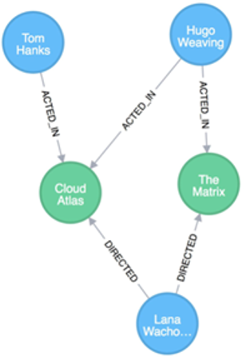

# Neo4j fundamentals

1. **[4 pkt]** Na rysunku zaprezentowano trzy węzły aktorów (kolor niebieski) oraz dwa węzły z nazwami filmów (kolor turkusowy).

    

    Korzystając ze strony SKOSu wydziału przygotuj:

    1. Bazę danych na podstawie SKOS, zawierającą 8 różnych relacji oraz 100-200 węzłów;
    2. Zapytania Cypher pozwalające na stworzenie węzła i jego relacji. Za pomocą rysunku przedstaw stworzenie dwóch relacji, najlepiej w jednym query.
    3. Opisać strukturę bazy jaka została przygotowana (przedstawić schemat jak np. https://github.com/neo4j/neo4j/issues/9726 lub rysując własny graf Arrow Tool). Przygotowany schemat załącz do sprawozdania w formie screenshotu bądź zewnętrznego pliku.

4. **[2 pkt]** Opisz różnicę między modelem grafowym a relacyjnym w bazach danych. Wymień co najmniej trzy punkty.
5. **[2 pkt]** Jakie podobieństwa można znaleźć pomiędzy bazami grafowymi i dokumentowymi (np. Mongodb)?
6. **[2 pkt]** Z przygotowanych w ramach niniejszego zadania zapytań Cypher przedstaw je w postaci SQL. Opisz krótko podobieństwa i różnice.
